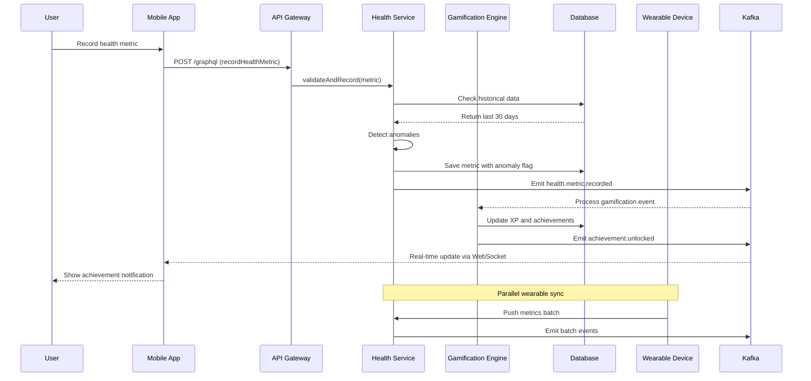
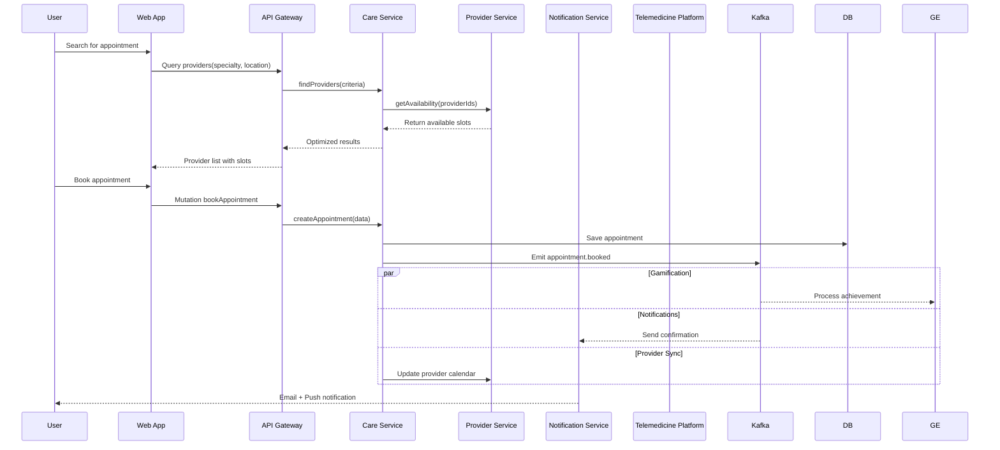
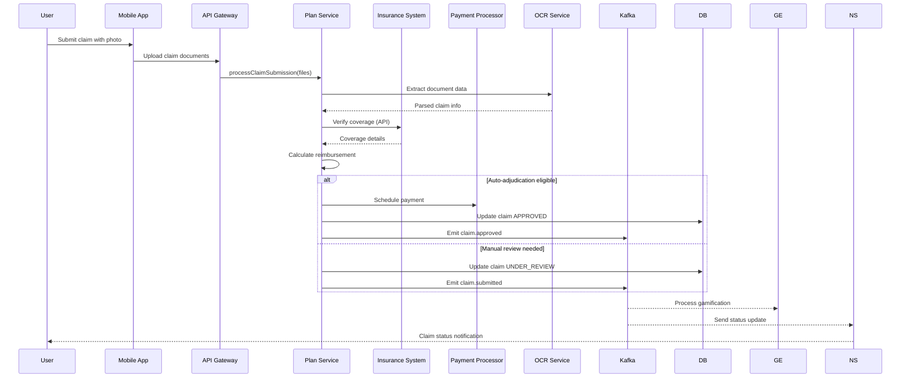

# Healthcare SuperApp Data Flow Architecture

## 1. Journey-Based Data Flows

### 1.1 Health Journey Data Flow



### 1.2 Care Journey Data Flow



### 1.3 Plan Journey Data Flow



## 2. Cross-Service Data Flows

### 2.1 Gamification Event Processing Flow

```yaml
Event Processing Pipeline:
  Input Sources:
    - health.events
    - care.events
    - plan.events
    
  Processing Stages:
    1. Event Ingestion:
       - Kafka consumer groups
       - Batch processing (100 events/batch)
       - Deduplication by eventId
       
    2. Rule Evaluation:
       - Load active rules from cache
       - Evaluate conditions in parallel
       - Calculate base XP
       
    3. Achievement Processing:
       - Check progress thresholds
       - Update achievement status
       - Calculate bonus XP
       
    4. Quest Updates:
       - Match event to quest objectives
       - Update progress counters
       - Check completion status
       
    5. Leaderboard Updates:
       - Update user scores
       - Recalculate rankings
       - Broadcast changes
       
    6. Notification Generation:
       - Create achievement notifications
       - Queue level-up announcements
       - Send quest completion alerts
```

### 2.2 Real-time Synchronization Flow

```typescript
// WebSocket Data Flow Architecture
class RealtimeDataFlow {
  private connections: Map<string, WebSocketConnection>;
  private subscriptions: Map<string, Set<string>>;
  
  async handleRealtimeUpdate(event: DataEvent): Promise<void> {
    // Determine affected users
    const affectedUsers = await this.getAffectedUsers(event);
    
    // Group by subscription channels
    const channelGroups = this.groupByChannels(affectedUsers, event);
    
    // Broadcast to each channel
    for (const [channel, users] of channelGroups) {
      const message = this.formatMessage(event, channel);
      
      await this.broadcast(channel, users, message);
    }
  }
  
  private async broadcast(
    channel: string,
    users: string[],
    message: any
  ): Promise<void> {
    const activeConnections = users
      .map(userId => this.connections.get(userId))
      .filter(conn => conn && conn.isAlive());
    
    // Parallel broadcast with error handling
    await Promise.allSettled(
      activeConnections.map(conn => conn.send(message))
    );
  }
}
```

### 2.3 Batch Processing Data Flow

```yaml
Nightly Batch Processing:
  Health Metrics Aggregation:
    Schedule: "0 2 * * *"  # 2 AM daily
    Steps:
      1. Extract raw metrics from TimescaleDB
      2. Calculate daily aggregates per user
      3. Detect long-term trends
      4. Generate insight recommendations
      5. Store in analytics database
      6. Queue personalized notifications
      
  Claims Reconciliation:
    Schedule: "0 3 * * *"  # 3 AM daily
    Steps:
      1. Fetch pending claims
      2. Query insurance system for updates
      3. Process bulk status changes
      4. Calculate payment schedules
      5. Update claim statuses
      6. Generate payment files
      
  Gamification Rollup:
    Schedule: "0 4 * * *"  # 4 AM daily
    Steps:
      1. Calculate daily XP totals
      2. Update weekly/monthly quests
      3. Process scheduled rewards
      4. Archive completed quests
      5. Reset daily challenges
      6. Update leaderboard cycles
```

## 3. Data Transformation Patterns

### 3.1 API Response Transformation

```typescript
// GraphQL Response Transformation
class ResponseTransformer {
  transformHealthMetric(raw: RawMetric): HealthMetricResponse {
    return {
      id: raw.id,
      type: this.mapMetricType(raw.type),
      value: this.formatValue(raw.value, raw.type),
      unit: this.getDisplayUnit(raw.unit),
      timestamp: raw.timestamp.toISOString(),
      source: this.mapSource(raw.source),
      trend: this.calculateTrend(raw),
      status: this.getMetricStatus(raw),
      anomaly: raw.anomaly ? {
        severity: raw.anomaly.severity,
        message: this.localizeMessage(raw.anomaly.message)
      } : null,
      gamification: {
        xpEarned: raw.xpEarned || 0,
        achievementUnlocked: raw.achievementId || null
      }
    };
  }
  
  private calculateTrend(metric: RawMetric): TrendInfo {
    if (!metric.historicalValues || metric.historicalValues.length < 2) {
      return { direction: 'stable', percentage: 0 };
    }
    
    const recent = metric.value;
    const previous = metric.historicalValues[0].value;
    const percentage = ((recent - previous) / previous) * 100;
    
    return {
      direction: percentage > 5 ? 'up' : percentage < -5 ? 'down' : 'stable',
      percentage: Math.abs(percentage),
      comparedTo: 'last_reading'
    };
  }
}
```

### 3.2 Event Enrichment Pattern

```typescript
// Event Enrichment Pipeline
class EventEnricher {
  async enrich(event: BaseEvent): Promise<EnrichedEvent> {
    // Parallel enrichment operations
    const [user, context, related] = await Promise.all([
      this.getUserContext(event.userId),
      this.getEventContext(event),
      this.getRelatedData(event)
    ]);
    
    return {
      ...event,
      enrichment: {
        user: {
          segment: user.segment,
          preferences: user.preferences,
          timezone: user.timezone
        },
        context: {
          journey: context.currentJourney,
          sessionId: context.sessionId,
          deviceType: context.deviceType
        },
        related: {
          previousEvents: related.previous,
          activeQuests: related.quests,
          eligibleAchievements: related.achievements
        }
      }
    };
  }
}
```

## 4. Data Consistency Patterns

### 4.1 Distributed Transaction Pattern

```typescript
// Saga Pattern Implementation
class AppointmentBookingSaga {
  private steps: SagaStep[] = [
    {
      name: 'reserve-slot',
      execute: this.reserveSlot.bind(this),
      compensate: this.releaseSlot.bind(this)
    },
    {
      name: 'verify-insurance',
      execute: this.verifyInsurance.bind(this),
      compensate: this.noOp.bind(this)
    },
    {
      name: 'create-appointment',
      execute: this.createAppointment.bind(this),
      compensate: this.cancelAppointment.bind(this)
    },
    {
      name: 'notify-provider',
      execute: this.notifyProvider.bind(this),
      compensate: this.noOp.bind(this)
    },
    {
      name: 'emit-events',
      execute: this.emitEvents.bind(this),
      compensate: this.noOp.bind(this)
    }
  ];
  
  async execute(context: SagaContext): Promise<SagaResult> {
    const executedSteps: CompletedStep[] = [];
    
    try {
      for (const step of this.steps) {
        const result = await step.execute(context);
        executedSteps.push({ step, result });
      }
      
      return { success: true, data: context.result };
    } catch (error) {
      // Compensate in reverse order
      for (const completed of executedSteps.reverse()) {
        try {
          await completed.step.compensate(completed.result);
        } catch (compensationError) {
          // Log compensation failure
          this.logger.error('Compensation failed', {
            step: completed.step.name,
            error: compensationError
          });
        }
      }
      
      throw new SagaFailedError(error, executedSteps);
    }
  }
}
```

### 4.2 Event Sourcing Pattern

```typescript
// Event Store Implementation
class HealthMetricEventStore {
  async append(event: MetricEvent): Promise<void> {
    const eventRecord = {
      aggregateId: event.userId,
      eventType: event.type,
      eventData: event.data,
      eventVersion: await this.getNextVersion(event.userId),
      timestamp: new Date(),
      metadata: {
        correlationId: event.correlationId,
        causationId: event.causationId
      }
    };
    
    await this.db.transaction(async (trx) => {
      // Append event
      await trx('health_events').insert(eventRecord);
      
      // Update snapshot if needed
      if (this.shouldSnapshot(eventRecord.eventVersion)) {
        const snapshot = await this.createSnapshot(event.userId);
        await trx('health_snapshots').insert(snapshot);
      }
    });
    
    // Publish to event stream
    await this.publisher.publish('health.events', eventRecord);
  }
  
  async replay(userId: string, fromVersion?: number): Promise<HealthAggregate> {
    // Load latest snapshot
    const snapshot = await this.getLatestSnapshot(userId);
    const startVersion = snapshot?.version || 0;
    
    // Load events after snapshot
    const events = await this.db('health_events')
      .where('aggregate_id', userId)
      .where('event_version', '>', Math.max(startVersion, fromVersion || 0))
      .orderBy('event_version');
    
    // Rebuild aggregate
    const aggregate = snapshot 
      ? HealthAggregate.fromSnapshot(snapshot)
      : new HealthAggregate(userId);
    
    for (const event of events) {
      aggregate.apply(event);
    }
    
    return aggregate;
  }
}
```

## 5. Data Privacy and Security Flows

### 5.1 PII Data Flow

```yaml
PII Handling Pipeline:
  Ingestion:
    - Identify PII fields (SSN, DOB, etc.)
    - Apply field-level encryption
    - Generate audit log entry
    
  Storage:
    - Encrypted at rest (AES-256)
    - Column-level encryption for sensitive fields
    - Separate PII from PHI where possible
    
  Processing:
    - Decrypt only when necessary
    - Use secure enclaves for processing
    - Re-encrypt before storage
    
  Access:
    - Role-based field access
    - Audit all PII access
    - Time-limited decryption keys
    
  Deletion:
    - Crypto-shredding for immediate deletion
    - Cascade deletion across systems
    - Retention policy enforcement
```

### 5.2 Audit Trail Flow

```typescript
// Comprehensive Audit Trail
class AuditService {
  async logDataAccess(context: AuditContext): Promise<void> {
    const auditEntry = {
      id: uuidv4(),
      timestamp: new Date(),
      userId: context.user.id,
      action: context.action,
      resource: context.resource,
      resourceId: context.resourceId,
      ip: context.request.ip,
      userAgent: context.request.userAgent,
      result: context.result,
      duration: context.duration,
      dataAccessed: this.sanitizeData(context.data),
      journey: context.user.currentJourney
    };
    
    // Write to immutable audit log
    await this.auditStore.append(auditEntry);
    
    // Check for suspicious patterns
    if (await this.detectAnomaly(auditEntry)) {
      await this.securityService.alert({
        type: 'SUSPICIOUS_ACCESS',
        entry: auditEntry
      });
    }
  }
  
  private sanitizeData(data: any): any {
    // Remove or mask sensitive fields
    return this.maskPII(data, [
      'ssn',
      'creditCard',
      'bankAccount',
      'medicalRecordNumber'
    ]);
  }
}
```

## 6. Performance Optimization Flows

### 6.1 Query Optimization Flow

```typescript
// Smart Query Caching
class QueryOptimizer {
  async executeQuery(query: GraphQLQuery): Promise<QueryResult> {
    // Generate cache key
    const cacheKey = this.generateCacheKey(query);
    
    // Check cache tiers
    const cached = await this.checkCache(cacheKey);
    if (cached && !this.isStale(cached)) {
      return cached.data;
    }
    
    // Execute parallel data fetching
    const dataSources = this.identifyDataSources(query);
    const results = await Promise.all(
      dataSources.map(ds => this.fetchFromSource(ds, query))
    );
    
    // Merge and transform results
    const merged = this.mergeResults(results);
    const transformed = this.applyTransformations(merged, query);
    
    // Update cache with TTL
    await this.updateCache(cacheKey, transformed, query.cacheTTL);
    
    return transformed;
  }
}
```

### 6.2 Batch Request Flow

```typescript
// DataLoader Pattern Implementation
class HealthMetricsLoader {
  private loader = new DataLoader(
    async (keys: readonly string[]) => {
      // Batch fetch metrics
      const metrics = await this.db('health_metrics')
        .whereIn('user_id', keys as string[])
        .orderBy('timestamp', 'desc');
      
      // Group by user
      const grouped = this.groupBy(metrics, 'user_id');
      
      // Return in same order as keys
      return keys.map(key => grouped[key] || []);
    },
    {
      maxBatchSize: 100,
      cache: true,
      cacheKeyFn: (key) => `metrics:${key}`
    }
  );
  
  async loadMetrics(userId: string): Promise<HealthMetric[]> {
    return this.loader.load(userId);
  }
}
```

This comprehensive data flow architecture ensures efficient, secure, and scalable data movement throughout the healthcare super app while maintaining consistency and privacy.