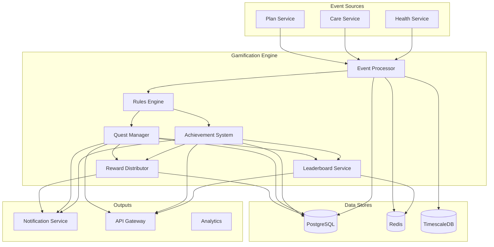

# Gamification Engine Architecture

> **Design Foundation**: Based on research showing 59% of gamified healthcare interventions report positive effects. Architecture incorporates anti-gaming measures, privacy-first design, and real-time processing for engagement while maintaining healthcare compliance.

## 1. Core Architecture Overview

### 1.1 Engine Components

```yaml
Gamification Engine Architecture:
  Core Components:
    Event Processor:
      - Kafka consumer for real-time events
      - Batch processing for efficiency
      - Event validation and enrichment
      - Anti-gaming detection
      
    Rules Engine:
      - Dynamic rule evaluation
      - Condition matching
      - Action execution
      - Rule versioning
      
    Achievement System:
      - Progress tracking
      - Unlock conditions
      - Tier management
      - Secret achievements
      
    Quest Manager:
      - Quest lifecycle
      - Objective tracking
      - Daily/Weekly/Monthly cycles
      - Collaborative quests
      
    Leaderboard Service:
      - Real-time rankings
      - Multiple dimensions
      - Privacy controls
      - Anti-gaming measures
      
    Reward Distributor:
      - Digital rewards
      - Physical rewards
      - Partner integrations
      - Fraud prevention
```

### 1.2 High-Level Architecture



## 2. Event Processing Architecture

### 2.1 Event Processor Design

```typescript
// High-Performance Event Processor
export class GamificationEventProcessor {
  private consumer: KafkaConsumer;
  private batchSize = 100;
  private processingInterval = 1000; // 1 second
  private eventBuffer: GameEvent[] = [];
  
  constructor(
    private rulesEngine: RulesEngine,
    private antiGamingService: AntiGamingService,
    private metricsCollector: MetricsCollector
  ) {
    this.initializeConsumer();
  }
  
  private async initializeConsumer(): Promise<void> {
    this.consumer = new KafkaConsumer({
      groupId: 'gamification-engine',
      topics: ['health.events', 'care.events', 'plan.events'],
      sessionTimeout: 30000,
      rebalanceTimeout: 60000,
      heartbeatInterval: 3000,
    });
    
    this.consumer.on('message', this.handleMessage.bind(this));
    this.startBatchProcessor();
  }
  
  private async handleMessage(message: KafkaMessage): Promise<void> {
    const startTime = Date.now();
    
    try {
      // Parse and validate event
      const event = this.parseEvent(message);
      
      // Quick anti-gaming check (< 5ms)
      const quickCheck = await this.antiGamingService.quickCheck(event);
      if (quickCheck.blocked) {
        this.metricsCollector.eventBlocked(event, quickCheck.reason);
        return;
      }
      
      // Add to buffer for batch processing
      this.eventBuffer.push(event);
      
      // Process immediately if buffer is full
      if (this.eventBuffer.length >= this.batchSize) {
        await this.processBatch();
      }
      
    } catch (error) {
      this.logger.error('Event processing failed', {
        error,
        message: message.value.toString(),
        duration: Date.now() - startTime,
      });
    }
  }
  
  private async processBatch(): Promise<void> {
    if (this.eventBuffer.length === 0) return;
    
    const batch = this.eventBuffer.splice(0, this.batchSize);
    const startTime = Date.now();
    
    try {
      // Group events by user for efficient processing
      const userEvents = this.groupByUser(batch);
      
      // Process each user's events
      const results = await Promise.all(
        Object.entries(userEvents).map(([userId, events]) =>
          this.processUserEvents(userId, events)
        )
      );
      
      // Flatten and emit results
      const allResults = results.flat();
      await this.emitResults(allResults);
      
      // Update metrics
      this.metricsCollector.batchProcessed({
        size: batch.length,
        duration: Date.now() - startTime,
        successCount: allResults.filter(r => r.success).length,
      });
      
    } catch (error) {
      this.logger.error('Batch processing failed', { error, batchSize: batch.length });
      // Re-queue failed events
      this.eventBuffer.unshift(...batch);
    }
  }
  
  private async processUserEvents(
    userId: string,
    events: GameEvent[]
  ): Promise<ProcessingResult[]> {
    // Load user profile once
    const profile = await this.profileService.load(userId);
    
    // Deep anti-gaming analysis for user
    const antiGamingResult = await this.antiGamingService.analyzeUser(userId, events);
    if (antiGamingResult.suspicious) {
      await this.flagUser(userId, antiGamingResult);
      return events.map(e => ({ event: e, success: false, reason: 'anti-gaming' }));
    }
    
    // Process events through rules engine
    const results: ProcessingResult[] = [];
    
    for (const event of events) {
      const result = await this.rulesEngine.process(event, profile);
      results.push(result);
      
      // Update profile with results
      profile.applyResult(result);
    }
    
    // Save updated profile
    await this.profileService.save(profile);
    
    return results;
  }
}
```

### 2.2 Anti-Gaming System

```typescript
// Anti-Gaming Detection and Prevention
export class AntiGamingService {
  private patterns = {
    velocityCheck: new VelocityChecker(),
    patternDetector: new PatternDetector(),
    anomalyDetector: new AnomalyDetector(),
    deviceFingerprint: new DeviceFingerprinter(),
  };
  
  async quickCheck(event: GameEvent): Promise<QuickCheckResult> {
    // Fast checks that must complete in < 5ms
    
    // Check daily caps
    const dailyUsage = await this.redis.get(`daily:${event.userId}:${event.type}`);
    if (dailyUsage >= this.getDailyCap(event.type)) {
      return { blocked: true, reason: 'daily_cap_exceeded' };
    }
    
    // Check rate limits
    const recentEvents = await this.redis.zcount(
      `events:${event.userId}`,
      Date.now() - 60000, // Last minute
      Date.now()
    );
    
    if (recentEvents > this.getRateLimit(event.type)) {
      return { blocked: true, reason: 'rate_limit_exceeded' };
    }
    
    // Check blacklist
    if (await this.isBlacklisted(event.userId)) {
      return { blocked: true, reason: 'user_blacklisted' };
    }
    
    return { blocked: false };
  }
  
  async analyzeUser(userId: string, events: GameEvent[]): Promise<AnalysisResult> {
    const results = await Promise.all([
      this.patterns.velocityCheck.analyze(userId, events),
      this.patterns.patternDetector.detect(userId, events),
      this.patterns.anomalyDetector.check(userId, events),
      this.patterns.deviceFingerprint.verify(userId, events),
    ]);
    
    const suspicionScore = this.calculateSuspicionScore(results);
    
    if (suspicionScore > 0.8) {
      // High suspicion - block and flag for review
      return {
        suspicious: true,
        score: suspicionScore,
        reasons: this.extractReasons(results),
        action: 'block_and_review',
      };
    } else if (suspicionScore > 0.5) {
      // Medium suspicion - allow but monitor closely
      await this.addToWatchlist(userId, suspicionScore);
      return {
        suspicious: false,
        score: suspicionScore,
        action: 'monitor',
      };
    }
    
    return { suspicious: false, score: suspicionScore };
  }
  
  private getDailyCap(eventType: string): number {
    const caps = {
      'health.metric.recorded': 500,  // Automated device syncs
      'appointment.booked': 10,
      'claim.submitted': 20,
      'achievement.manual_claim': 5,
      'quest.completed': 50,
    };
    
    return caps[eventType] || 100;
  }
}

// Pattern Detection for Gaming Behavior
export class PatternDetector {
  private patterns = [
    {
      name: 'rapid_fire',
      detect: (events: GameEvent[]) => {
        // Detect unnaturally fast event sequences
        const timeDiffs = this.getTimeDifferences(events);
        return timeDiffs.some(diff => diff < 100); // < 100ms between events
      },
    },
    {
      name: 'perfect_timing',
      detect: (events: GameEvent[]) => {
        // Detect suspiciously regular intervals
        const intervals = this.getIntervals(events);
        const variance = this.calculateVariance(intervals);
        return variance < 10; // Too consistent
      },
    },
    {
      name: 'impossible_values',
      detect: (events: GameEvent[]) => {
        // Detect impossible health metrics
        return events.some(e => {
          if (e.type === 'health.metric.recorded') {
            const value = e.data.value;
            const type = e.data.metricType;
            return this.isImpossibleValue(type, value);
          }
          return false;
        });
      },
    },
  ];
  
  async detect(userId: string, events: GameEvent[]): Promise<DetectionResult> {
    const detectedPatterns = this.patterns
      .filter(pattern => pattern.detect(events))
      .map(p => p.name);
    
    if (detectedPatterns.length > 0) {
      await this.recordPatterns(userId, detectedPatterns);
    }
    
    return {
      patternsDetected: detectedPatterns,
      confidence: detectedPatterns.length / this.patterns.length,
    };
  }
}
```

## 3. Rules Engine Architecture

### 3.1 Rule Definition and Evaluation

```typescript
// Flexible Rules Engine
export interface GameRule {
  id: string;
  name: string;
  description: string;
  version: number;
  active: boolean;
  priority: number;
  conditions: RuleCondition[];
  actions: RuleAction[];
  metadata: {
    journey: Journey;
    category: string;
    tags: string[];
  };
}

export class RulesEngine {
  private ruleCache: Map<string, GameRule[]> = new Map();
  private ruleEvaluator: RuleEvaluator;
  
  async process(event: GameEvent, profile: UserProfile): Promise<ProcessingResult> {
    // Get applicable rules
    const rules = await this.getApplicableRules(event, profile);
    
    // Sort by priority
    const sortedRules = rules.sort((a, b) => b.priority - a.priority);
    
    const results: RuleResult[] = [];
    
    for (const rule of sortedRules) {
      // Evaluate conditions
      const conditionsMet = await this.evaluateConditions(rule.conditions, event, profile);
      
      if (conditionsMet) {
        // Execute actions
        const actionResults = await this.executeActions(rule.actions, event, profile);
        
        results.push({
          ruleId: rule.id,
          ruleName: rule.name,
          triggered: true,
          actions: actionResults,
        });
        
        // Check if rule is exclusive
        if (rule.metadata.exclusive) {
          break;
        }
      }
    }
    
    return {
      event,
      success: true,
      rulesTriggered: results,
      totalXP: results.reduce((sum, r) => sum + (r.actions.xp || 0), 0),
      achievements: results.flatMap(r => r.actions.achievements || []),
      rewards: results.flatMap(r => r.actions.rewards || []),
    };
  }
  
  private async evaluateConditions(
    conditions: RuleCondition[],
    event: GameEvent,
    profile: UserProfile
  ): Promise<boolean> {
    // Support AND/OR logic
    for (const condition of conditions) {
      const met = await this.evaluateCondition(condition, event, profile);
      
      if (condition.operator === 'OR' && met) {
        return true;
      }
      if (condition.operator === 'AND' && !met) {
        return false;
      }
    }
    
    return true;
  }
  
  private async evaluateCondition(
    condition: RuleCondition,
    event: GameEvent,
    profile: UserProfile
  ): Promise<boolean> {
    switch (condition.type) {
      case 'event_type':
        return event.type === condition.value;
        
      case 'event_data':
        return this.matchesData(event.data, condition.path, condition.operator, condition.value);
        
      case 'user_level':
        return this.compareValue(profile.level, condition.operator, condition.value);
        
      case 'streak':
        const streak = await this.getStreak(profile.userId, condition.streakType);
        return this.compareValue(streak, condition.operator, condition.value);
        
      case 'time_window':
        return this.isInTimeWindow(condition.startTime, condition.endTime);
        
      case 'achievement_unlocked':
        return profile.hasAchievement(condition.achievementId);
        
      case 'quest_progress':
        const progress = await this.getQuestProgress(profile.userId, condition.questId);
        return this.compareValue(progress, condition.operator, condition.value);
        
      default:
        return false;
    }
  }
}

// Rule Action Executor
export class ActionExecutor {
  async execute(action: RuleAction, context: ActionContext): Promise<ActionResult> {
    switch (action.type) {
      case 'award_xp':
        return this.awardXP(context.userId, action.amount, action.reason);
        
      case 'unlock_achievement':
        return this.unlockAchievement(context.userId, action.achievementId, action.tier);
        
      case 'update_quest':
        return this.updateQuest(context.userId, action.questId, action.progress);
        
      case 'grant_reward':
        return this.grantReward(context.userId, action.rewardId, action.metadata);
        
      case 'trigger_notification':
        return this.triggerNotification(context.userId, action.template, action.data);
        
      case 'update_leaderboard':
        return this.updateLeaderboard(context.userId, action.leaderboardId, action.points);
        
      case 'bonus_multiplier':
        return this.applyMultiplier(context.userId, action.multiplier, action.duration);
        
      default:
        throw new Error(`Unknown action type: ${action.type}`);
    }
  }
}
```

### 3.2 Dynamic Rule Management

```typescript
// Rule Lifecycle Management
export class RuleManager {
  async createRule(rule: GameRule): Promise<void> {
    // Validate rule structure
    await this.validateRule(rule);
    
    // Version management
    const existingRule = await this.getRuleById(rule.id);
    if (existingRule) {
      rule.version = existingRule.version + 1;
      await this.archiveRule(existingRule);
    }
    
    // Save rule
    await this.repository.save(rule);
    
    // Update cache
    await this.updateRuleCache(rule);
    
    // Emit rule change event
    await this.eventBus.emit('rule.created', { rule });
  }
  
  async updateRule(ruleId: string, updates: Partial<GameRule>): Promise<void> {
    const rule = await this.getRuleById(ruleId);
    
    // Create new version
    const updatedRule = {
      ...rule,
      ...updates,
      version: rule.version + 1,
      updatedAt: new Date(),
    };
    
    // Validate changes
    await this.validateRule(updatedRule);
    
    // A/B testing support
    if (updates.abTest) {
      await this.setupABTest(rule, updatedRule, updates.abTest);
    } else {
      // Direct update
      await this.repository.save(updatedRule);
      await this.updateRuleCache(updatedRule);
    }
  }
  
  private async setupABTest(
    original: GameRule,
    variant: GameRule,
    config: ABTestConfig
  ): Promise<void> {
    const abTest = {
      id: uuidv4(),
      originalRuleId: original.id,
      variantRuleId: `${variant.id}_variant`,
      startDate: config.startDate,
      endDate: config.endDate,
      trafficSplit: config.trafficSplit,
      metrics: config.metrics,
    };
    
    // Save variant rule
    await this.repository.save({ ...variant, id: abTest.variantRuleId });
    
    // Setup traffic splitting
    await this.abTestService.create(abTest);
  }
}
```

## 4. Achievement System Design

### 4.1 Achievement Architecture

```typescript
// Progressive Achievement System
export class AchievementSystem {
  private achievementDefinitions: Map<string, Achievement> = new Map();
  
  async checkAchievements(
    userId: string,
    event: GameEvent,
    profile: UserProfile
  ): Promise<UnlockedAchievement[]> {
    // Get relevant achievements for event
    const candidates = await this.getCandidateAchievements(event, profile);
    
    const unlocked: UnlockedAchievement[] = [];
    
    for (const achievement of candidates) {
      // Check if already unlocked at higher tier
      const currentTier = profile.getAchievementTier(achievement.id);
      
      for (const tier of achievement.tiers) {
        if (tier.level <= currentTier) continue;
        
        // Evaluate unlock conditions
        const qualified = await this.evaluateUnlockConditions(
          tier.conditions,
          userId,
          event,
          profile
        );
        
        if (qualified) {
          // Unlock achievement
          const unlockedAchievement = await this.unlockAchievement(
            userId,
            achievement,
            tier
          );
          
          unlocked.push(unlockedAchievement);
          
          // Update profile
          profile.addAchievement(unlockedAchievement);
          
          // Check for meta-achievements
          await this.checkMetaAchievements(userId, profile);
          
          break; // Only unlock one tier at a time
        }
      }
    }
    
    return unlocked;
  }
  
  private async unlockAchievement(
    userId: string,
    achievement: Achievement,
    tier: AchievementTier
  ): Promise<UnlockedAchievement> {
    const unlockedAt = new Date();
    
    const unlocked = {
      id: uuidv4(),
      userId,
      achievementId: achievement.id,
      achievementName: achievement.name,
      tier: tier.level,
      tierName: tier.name,
      xpAwarded: tier.xpReward,
      unlockedAt,
      rarity: await this.calculateRarity(achievement.id, tier.level),
      shareableImage: await this.generateShareableImage(achievement, tier),
    };
    
    // Save to database
    await this.repository.saveUnlockedAchievement(unlocked);
    
    // Update statistics
    await this.updateAchievementStats(achievement.id, tier.level);
    
    // Trigger celebration
    await this.triggerCelebration(userId, unlocked);
    
    return unlocked;
  }
  
  private async calculateRarity(achievementId: string, tier: number): Promise<number> {
    const totalUsers = await this.getTotalActiveUsers();
    const unlockedCount = await this.getUnlockedCount(achievementId, tier);
    
    return (unlockedCount / totalUsers) * 100;
  }
}

// Achievement Definition
export interface Achievement {
  id: string;
  name: string;
  description: string;
  category: AchievementCategory;
  journey: Journey;
  icon: string;
  secret: boolean;
  tiers: AchievementTier[];
  metadata: {
    difficulty: 'easy' | 'medium' | 'hard' | 'expert';
    estimatedTime: string;
    prerequisites: string[];
  };
}

export interface AchievementTier {
  level: number;
  name: string;
  description: string;
  conditions: AchievementCondition[];
  xpReward: number;
  badges: string[];
  unlockMessage: string;
}
```

### 4.2 Secret Achievement System

```typescript
// Secret Achievement Handler
export class SecretAchievementSystem {
  private secretAchievements: SecretAchievement[] = [
    {
      id: 'night_owl',
      name: 'Night Owl',
      description: 'Record health metrics between 2 AM and 4 AM',
      condition: (event) => {
        const hour = new Date(event.timestamp).getHours();
        return event.type === 'health.metric.recorded' && 
               hour >= 2 && hour < 4;
      },
      hint: 'Some achievements are unlocked at unusual times...',
    },
    {
      id: 'perfect_week',
      name: 'Perfect Week',
      description: 'Complete all daily health goals for 7 consecutive days',
      condition: async (event, profile) => {
        const streak = await this.getGoalStreak(profile.userId);
        return streak >= 7;
      },
      hint: 'Consistency is key to unlocking special rewards',
    },
    {
      id: 'helper',
      name: 'Good Samaritan',
      description: 'Help 5 family members with their health goals',
      condition: async (event, profile) => {
        const helpCount = await this.getFamilyHelpCount(profile.userId);
        return helpCount >= 5;
      },
      hint: 'Sometimes helping others helps you too',
    },
  ];
  
  async checkSecretAchievements(
    event: GameEvent,
    profile: UserProfile
  ): Promise<UnlockedAchievement[]> {
    const unlocked: UnlockedAchievement[] = [];
    
    for (const secret of this.secretAchievements) {
      // Skip if already unlocked
      if (profile.hasAchievement(secret.id)) continue;
      
      // Check condition
      const qualified = await secret.condition(event, profile);
      
      if (qualified) {
        const unlockedAchievement = await this.unlockSecretAchievement(
          profile.userId,
          secret
        );
        
        unlocked.push(unlockedAchievement);
        
        // Extra celebration for secret achievements
        await this.triggerSpecialCelebration(profile.userId, secret);
      }
    }
    
    return unlocked;
  }
}
```

## 5. Quest System Architecture

### 5.1 Quest Management

```typescript
// Dynamic Quest System
export class QuestManager {
  private questTemplates: Map<string, QuestTemplate> = new Map();
  private activeQuests: Map<string, UserQuest[]> = new Map();
  
  async generateDailyQuests(userId: string, profile: UserProfile): Promise<Quest[]> {
    // Get user's quest history
    const history = await this.getQuestHistory(userId);
    
    // Select quest templates based on user profile
    const templates = await this.selectQuestTemplates(profile, history, {
      count: 3,
      difficulty: this.calculateDifficulty(profile),
      variety: true,
      personalized: true,
    });
    
    // Generate quest instances
    const quests: Quest[] = [];
    
    for (const template of templates) {
      const quest = await this.instantiateQuest(template, userId, {
        startTime: new Date(),
        endTime: this.getEndOfDay(),
        multiplier: this.getQuestMultiplier(profile),
      });
      
      quests.push(quest);
    }
    
    // Save active quests
    await this.saveActiveQuests(userId, quests);
    
    return quests;
  }
  
  async updateQuestProgress(
    userId: string,
    event: GameEvent
  ): Promise<QuestProgressUpdate[]> {
    const activeQuests = await this.getActiveQuests(userId);
    const updates: QuestProgressUpdate[] = [];
    
    for (const quest of activeQuests) {
      // Check if event matches quest objectives
      for (const objective of quest.objectives) {
        if (this.matchesObjective(event, objective)) {
          // Update progress
          const update = await this.incrementObjectiveProgress(
            quest,
            objective,
            event
          );
          
          updates.push(update);
          
          // Check if objective completed
          if (update.completed) {
            await this.onObjectiveCompleted(userId, quest, objective);
          }
          
          // Check if quest completed
          if (await this.isQuestCompleted(quest)) {
            await this.completeQuest(userId, quest);
          }
        }
      }
    }
    
    return updates;
  }
  
  private async completeQuest(userId: string, quest: UserQuest): Promise<void> {
    // Calculate rewards
    const rewards = this.calculateQuestRewards(quest);
    
    // Grant rewards
    await this.rewardService.grantRewards(userId, rewards);
    
    // Update quest status
    quest.status = 'completed';
    quest.completedAt = new Date();
    await this.repository.updateQuest(quest);
    
    // Trigger notifications
    await this.notificationService.sendQuestComplete(userId, quest, rewards);
    
    // Check for quest chains
    if (quest.nextQuestId) {
      await this.unlockNextQuest(userId, quest.nextQuestId);
    }
  }
}

// Quest Types
export interface QuestTemplate {
  id: string;
  name: string;
  description: string;
  category: QuestCategory;
  journey: Journey;
  objectives: QuestObjectiveTemplate[];
  rewards: QuestReward[];
  requirements: QuestRequirement[];
  metadata: {
    difficulty: number; // 1-10
    estimatedTime: number; // minutes
    collaborative: boolean;
    repeatable: boolean;
  };
}

export interface QuestObjectiveTemplate {
  id: string;
  description: string;
  type: ObjectiveType;
  target: {
    eventType?: string;
    metricType?: string;
    count?: number;
    value?: number;
    condition?: string;
  };
  optional: boolean;
}
```

### 5.2 Collaborative Quest System

```typescript
// Family and Group Quest Management
export class CollaborativeQuestSystem {
  async createFamilyQuest(
    familyId: string,
    questTemplate: QuestTemplate
  ): Promise<FamilyQuest> {
    // Get family members
    const members = await this.getFamilyMembers(familyId);
    
    // Create shared quest instance
    const familyQuest = {
      id: uuidv4(),
      familyId,
      questTemplateId: questTemplate.id,
      members: members.map(m => ({
        userId: m.id,
        role: this.assignRole(m, questTemplate),
        contribution: 0,
      })),
      objectives: questTemplate.objectives.map(obj => ({
        ...obj,
        progress: 0,
        contributions: new Map<string, number>(),
      })),
      startTime: new Date(),
      endTime: this.calculateEndTime(questTemplate),
      status: 'active',
    };
    
    // Save and notify members
    await this.repository.saveFamilyQuest(familyQuest);
    await this.notifyFamilyMembers(familyQuest);
    
    return familyQuest;
  }
  
  async updateFamilyQuestProgress(
    userId: string,
    event: GameEvent
  ): Promise<void> {
    // Get user's family quests
    const familyQuests = await this.getActiveFamilyQuests(userId);
    
    for (const quest of familyQuests) {
      // Check if event contributes to quest
      const contribution = await this.calculateContribution(event, quest, userId);
      
      if (contribution > 0) {
        // Update member contribution
        await this.updateMemberContribution(quest, userId, contribution);
        
        // Update objective progress
        await this.updateObjectiveProgress(quest, event, contribution);
        
        // Check if quest completed
        if (this.isQuestCompleted(quest)) {
          await this.completeFamilyQuest(quest);
        } else {
          // Notify progress update
          await this.notifyProgressUpdate(quest, userId, contribution);
        }
      }
    }
  }
  
  private async completeFamilyQuest(quest: FamilyQuest): Promise<void> {
    // Calculate individual rewards based on contribution
    const rewards = quest.members.map(member => ({
      userId: member.userId,
      rewards: this.calculateMemberRewards(
        quest.baseRewards,
        member.contribution,
        quest.totalContribution
      ),
    }));
    
    // Grant rewards
    for (const memberReward of rewards) {
      await this.rewardService.grantRewards(
        memberReward.userId,
        memberReward.rewards
      );
    }
    
    // Update quest status
    quest.status = 'completed';
    quest.completedAt = new Date();
    await this.repository.updateFamilyQuest(quest);
    
    // Celebrate completion
    await this.celebrateFamilyAchievement(quest);
  }
}
```

## 6. Leaderboard Architecture

### 6.1 Real-time Leaderboard System

```typescript
// High-Performance Leaderboard Service
export class LeaderboardService {
  private redis: RedisClient;
  private updateQueue: LeaderboardUpdate[] = [];
  private batchInterval = 100; // ms
  
  constructor() {
    this.startBatchProcessor();
  }
  
  async updateScore(
    userId: string,
    leaderboardId: string,
    points: number
  ): Promise<void> {
    // Queue update for batch processing
    this.updateQueue.push({
      userId,
      leaderboardId,
      points,
      timestamp: Date.now(),
    });
  }
  
  private async processBatch(): Promise<void> {
    if (this.updateQueue.length === 0) return;
    
    const updates = this.updateQueue.splice(0, 1000); // Process up to 1000 at once
    
    // Group by leaderboard
    const grouped = this.groupBy(updates, 'leaderboardId');
    
    // Process each leaderboard
    await Promise.all(
      Object.entries(grouped).map(([leaderboardId, leaderboardUpdates]) =>
        this.updateLeaderboard(leaderboardId, leaderboardUpdates)
      )
    );
  }
  
  private async updateLeaderboard(
    leaderboardId: string,
    updates: LeaderboardUpdate[]
  ): Promise<void> {
    const pipeline = this.redis.pipeline();
    
    for (const update of updates) {
      // Update user score
      pipeline.zadd(
        `lb:${leaderboardId}:current`,
        update.points,
        update.userId
      );
      
      // Update time-based leaderboards
      pipeline.zadd(
        `lb:${leaderboardId}:daily:${this.getDateKey()}`,
        update.points,
        update.userId
      );
      
      pipeline.zadd(
        `lb:${leaderboardId}:weekly:${this.getWeekKey()}`,
        update.points,
        update.userId
      );
      
      pipeline.zadd(
        `lb:${leaderboardId}:monthly:${this.getMonthKey()}`,
        update.points,
        update.userId
      );
    }
    
    await pipeline.exec();
    
    // Update cached rankings
    await this.updateCachedRankings(leaderboardId);
  }
  
  async getLeaderboard(
    leaderboardId: string,
    options: LeaderboardOptions
  ): Promise<LeaderboardResult> {
    const key = this.getLeaderboardKey(leaderboardId, options.timeframe);
    
    // Get top rankings
    const topRankings = await this.redis.zrevrange(
      key,
      0,
      options.limit - 1,
      'WITHSCORES'
    );
    
    // Get user's ranking if requested
    let userRanking = null;
    if (options.userId) {
      userRanking = await this.getUserRanking(key, options.userId);
    }
    
    // Format results
    const rankings = this.formatRankings(topRankings);
    
    // Apply privacy filters
    const filtered = await this.applyPrivacyFilters(rankings, options.userId);
    
    return {
      leaderboardId,
      timeframe: options.timeframe,
      rankings: filtered,
      userRanking,
      lastUpdated: await this.getLastUpdateTime(key),
    };
  }
  
  private async applyPrivacyFilters(
    rankings: LeaderboardEntry[],
    requesterId?: string
  ): Promise<LeaderboardEntry[]> {
    // Load privacy preferences
    const userIds = rankings.map(r => r.userId);
    const preferences = await this.privacyService.getPreferences(userIds);
    
    return rankings.map(ranking => {
      const pref = preferences[ranking.userId];
      
      if (pref.publicProfile || ranking.userId === requesterId) {
        return ranking;
      }
      
      // Anonymize based on preferences
      return {
        ...ranking,
        displayName: pref.showInitials ? this.getInitials(ranking.displayName) : 'Anonymous',
        avatar: null,
        userId: null, // Hide actual ID
      };
    });
  }
}
```

### 6.2 Anti-Gaming Leaderboard Protection

```typescript
// Leaderboard Integrity Protection
export class LeaderboardIntegrityService {
  async validateScore(
    userId: string,
    leaderboardId: string,
    score: number
  ): Promise<ValidationResult> {
    // Check score bounds
    const bounds = await this.getScoreBounds(leaderboardId);
    if (score < bounds.min || score > bounds.max) {
      return { valid: false, reason: 'score_out_of_bounds' };
    }
    
    // Check score velocity
    const recentScores = await this.getRecentScores(userId, leaderboardId);
    const velocity = this.calculateVelocity(recentScores, score);
    
    if (velocity > bounds.maxVelocity) {
      return { valid: false, reason: 'suspicious_velocity' };
    }
    
    // Statistical anomaly detection
    const userStats = await this.getUserStatistics(userId, leaderboardId);
    const zScore = (score - userStats.mean) / userStats.stdDev;
    
    if (Math.abs(zScore) > 4) {
      // Flag for manual review
      await this.flagForReview(userId, leaderboardId, score, 'statistical_anomaly');
      return { valid: true, flagged: true };
    }
    
    // Pattern detection
    const pattern = await this.detectSuspiciousPattern(userId, leaderboardId);
    if (pattern) {
      await this.flagForReview(userId, leaderboardId, score, pattern);
      return { valid: true, flagged: true };
    }
    
    return { valid: true };
  }
  
  async cleanLeaderboards(): Promise<void> {
    // Remove flagged users
    const flaggedUsers = await this.getFlaggedUsers();
    
    for (const user of flaggedUsers) {
      if (user.confirmed) {
        // Remove from all leaderboards
        await this.removeFromLeaderboards(user.userId);
        
        // Ban from future participation
        await this.banUser(user.userId, user.reason);
      }
    }
    
    // Recalculate rankings
    await this.recalculateAllRankings();
  }
}
```

## 7. Reward Distribution System

### 7.1 Reward Management

```typescript
// Secure Reward Distribution
export class RewardDistributor {
  private rewardQueue: RewardRequest[] = [];
  private processingInterval = 5000; // 5 seconds
  
  async queueReward(
    userId: string,
    rewardType: RewardType,
    metadata: any
  ): Promise<string> {
    const rewardId = uuidv4();
    
    const request: RewardRequest = {
      id: rewardId,
      userId,
      rewardType,
      metadata,
      status: 'pending',
      createdAt: new Date(),
      attempts: 0,
    };
    
    // Validate reward eligibility
    const eligible = await this.validateEligibility(userId, rewardType, metadata);
    if (!eligible.valid) {
      throw new RewardEligibilityError(eligible.reason);
    }
    
    // Queue for processing
    await this.repository.saveRewardRequest(request);
    this.rewardQueue.push(request);
    
    return rewardId;
  }
  
  private async processRewardBatch(): Promise<void> {
    const batch = this.rewardQueue.splice(0, 50);
    if (batch.length === 0) return;
    
    for (const request of batch) {
      try {
        await this.processReward(request);
      } catch (error) {
        await this.handleRewardError(request, error);
      }
    }
  }
  
  private async processReward(request: RewardRequest): Promise<void> {
    switch (request.rewardType) {
      case RewardType.DIGITAL_CONTENT:
        await this.grantDigitalContent(request);
        break;
        
      case RewardType.PARTNER_DISCOUNT:
        await this.generateDiscountCode(request);
        break;
        
      case RewardType.PREMIUM_FEATURE:
        await this.unlockPremiumFeature(request);
        break;
        
      case RewardType.PHYSICAL_REWARD:
        await this.processPhysicalReward(request);
        break;
        
      case RewardType.INSURANCE_BENEFIT:
        await this.applyInsuranceBenefit(request);
        break;
    }
    
    // Update status
    request.status = 'completed';
    request.completedAt = new Date();
    await this.repository.updateRewardRequest(request);
    
    // Notify user
    await this.notificationService.sendRewardNotification(request);
  }
  
  private async generateDiscountCode(request: RewardRequest): Promise<void> {
    // Partner integration
    const partner = await this.partnerService.getPartner(request.metadata.partnerId);
    
    // Generate unique code
    const code = await partner.generateDiscountCode({
      userId: request.userId,
      discount: request.metadata.discountPercentage,
      validUntil: this.calculateExpiry(30), // 30 days
      singleUse: true,
    });
    
    // Save code
    await this.repository.saveDiscountCode({
      userId: request.userId,
      rewardId: request.id,
      code: code.code,
      partnerId: partner.id,
      expiresAt: code.validUntil,
    });
  }
}
```

## 8. Analytics and Monitoring

### 8.1 Gamification Analytics

```typescript
// Real-time Analytics Pipeline
export class GamificationAnalytics {
  private metricsCollector: MetricsCollector;
  private eventStream: EventStream;
  
  async trackEvent(event: AnalyticsEvent): Promise<void> {
    // Real-time metrics
    this.updateRealTimeMetrics(event);
    
    // Stream to analytics pipeline
    await this.eventStream.publish('analytics.gamification', event);
    
    // Update dashboards
    await this.updateDashboards(event);
  }
  
  private updateRealTimeMetrics(event: AnalyticsEvent): void {
    switch (event.type) {
      case 'xp_earned':
        this.metricsCollector.increment('gamification.xp.total', event.data.amount);
        this.metricsCollector.histogram('gamification.xp.distribution', event.data.amount);
        break;
        
      case 'achievement_unlocked':
        this.metricsCollector.increment('gamification.achievements.unlocked');
        this.metricsCollector.gauge('gamification.achievements.rarity', event.data.rarity);
        break;
        
      case 'quest_completed':
        this.metricsCollector.increment('gamification.quests.completed');
        this.metricsCollector.timing('gamification.quests.duration', event.data.duration);
        break;
        
      case 'leaderboard_position_changed':
        this.metricsCollector.gauge('gamification.leaderboard.position', event.data.newPosition);
        break;
    }
  }
  
  async generateInsights(): Promise<GamificationInsights> {
    const metrics = await this.aggregateMetrics();
    
    return {
      engagement: {
        dailyActiveUsers: metrics.dau,
        averageSessionLength: metrics.sessionLength,
        retentionRate: metrics.retention,
        viralityCoefficient: metrics.virality,
      },
      progression: {
        averageLevel: metrics.avgLevel,
        levelDistribution: metrics.levelDist,
        xpVelocity: metrics.xpVelocity,
        completionRates: metrics.completionRates,
      },
      monetization: {
        rewardRedemptionRate: metrics.redemptionRate,
        costPerReward: metrics.costPerReward,
        roiByRewardType: metrics.rewardROI,
      },
      health: {
        antiGamingDetections: metrics.antiGamingCount,
        systemPerformance: metrics.performance,
        errorRates: metrics.errors,
      },
    };
  }
}
```

This comprehensive gamification engine architecture provides a robust, scalable, and secure foundation for driving user engagement while maintaining trust and preventing gaming behaviors in the healthcare super app.