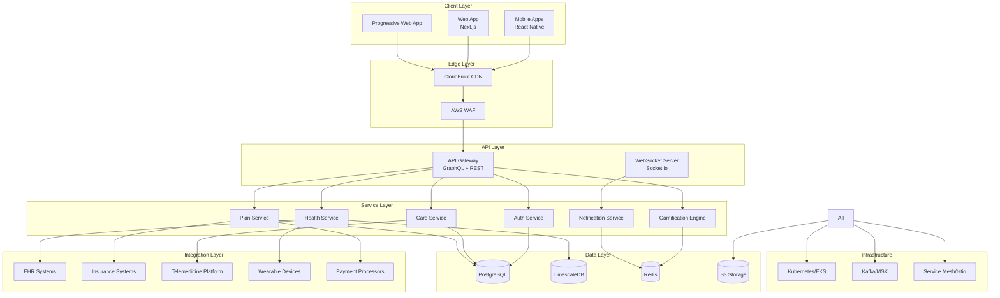

# AUSTA SuperApp - System Architecture Design

## 1. High-Level Architecture

### 1.1 System Overview



### 1.2 Component Interactions

```yaml
Journey-Based Architecture:
  My Health Journey:
    Entry: Mobile/Web App
    Gateway: GraphQL Query
    Services: Health Service, Gamification
    Data: TimescaleDB (metrics), PostgreSQL (records)
    Integrations: Wearables, EHR Systems
    
  Care Now Journey:
    Entry: Mobile/Web App
    Gateway: GraphQL Mutation
    Services: Care Service, Notification, Gamification
    Data: PostgreSQL, Redis (real-time)
    Integrations: Provider Systems, Telemedicine
    
  My Plan Journey:
    Entry: Mobile/Web App
    Gateway: GraphQL Query/Mutation
    Services: Plan Service, Gamification
    Data: PostgreSQL, S3 (documents)
    Integrations: Insurance Systems, Payment

Cross-Cutting Flows:
  Authentication:
    Flow: App -> Gateway -> Auth Service -> PostgreSQL/Redis
    Tokens: JWT with refresh
    Sessions: Redis with 30min TTL
    
  Gamification:
    Flow: All Services -> Kafka -> Gamification Engine -> Redis/PostgreSQL
    Processing: Event-driven, async
    Updates: Real-time via WebSocket
    
  Notifications:
    Flow: All Services -> Notification Service -> Channels
    Channels: Push, Email, SMS, In-App
    Priority: Queue-based with priorities
```

## 2. Core Algorithms

### 2.1 Gamification Event Processing

```
ALGORITHM: ProcessGamificationEvent
INPUT: event (UserAction)
OUTPUT: rewards (Achievements, XP, Rewards)

FUNCTION ProcessGamificationEvent(event):
    // Validate and enrich event
    IF NOT ValidateEvent(event) THEN
        LOG error "Invalid event", event
        RETURN empty
    END IF
    
    enrichedEvent = EnrichEvent(event)
    
    // Load user's game profile
    profile = LoadGameProfile(event.userId)
    
    // Apply rules engine
    applicableRules = FindApplicableRules(enrichedEvent, profile)
    results = []
    
    FOR EACH rule IN applicableRules:
        IF EvaluateCondition(rule.condition, enrichedEvent, profile) THEN
            actions = ExecuteActions(rule.actions, profile)
            results.APPEND(actions)
        END IF
    END FOR
    
    // Update user profile
    newProfile = UpdateProfile(profile, results)
    
    // Check for level progression
    IF newProfile.xp >= GetNextLevelThreshold(newProfile.level) THEN
        levelUp = ProcessLevelUp(newProfile)
        results.APPEND(levelUp)
    END IF
    
    // Check for achievement unlocks
    unlockedAchievements = CheckAchievements(newProfile, enrichedEvent)
    results.APPEND(unlockedAchievements)
    
    // Persist changes
    TRANSACTION:
        SaveProfile(newProfile)
        RecordEvent(enrichedEvent)
        SaveRewards(results)
    END TRANSACTION
    
    // Trigger notifications
    NotifyUser(event.userId, results)
    UpdateLeaderboards(event.userId, newProfile)
    
    RETURN results
END FUNCTION

FUNCTION EvaluateCondition(condition, event, profile):
    SWITCH condition.type:
        CASE "SIMPLE":
            RETURN EvaluateSimpleCondition(condition, event)
        CASE "COMPLEX":
            RETURN EvaluateComplexCondition(condition, event, profile)
        CASE "TIME_BASED":
            RETURN EvaluateTimeCondition(condition, event, profile)
        CASE "STREAK":
            RETURN EvaluateStreakCondition(condition, profile)
    END SWITCH
END FUNCTION
```

### 2.2 Health Metric Anomaly Detection

```
ALGORITHM: DetectHealthAnomalies
INPUT: metric (HealthMetric), userHistory (MetricHistory)
OUTPUT: anomaly (AnomalyAlert | null)

FUNCTION DetectHealthAnomalies(metric, userHistory):
    // Get baseline statistics
    baseline = CalculateBaseline(userHistory, metric.type)
    
    // Check absolute thresholds
    thresholds = GetMedicalThresholds(metric.type, user.profile)
    IF metric.value < thresholds.min OR metric.value > thresholds.max THEN
        RETURN CreateAlert("CRITICAL", metric, thresholds)
    END IF
    
    // Statistical anomaly detection
    zScore = (metric.value - baseline.mean) / baseline.stdDev
    IF ABS(zScore) > 3 THEN
        severity = DetermineSeverity(zScore, metric.type)
        RETURN CreateAlert(severity, metric, baseline)
    END IF
    
    // Trend analysis
    trend = AnalyzeTrend(userHistory, metric)
    IF trend.isAbnormal THEN
        RETURN CreateAlert("WARNING", metric, trend)
    END IF
    
    // Pattern recognition
    pattern = DetectPattern(userHistory, metric)
    IF pattern.type == "DANGEROUS" THEN
        RETURN CreateAlert("WARNING", metric, pattern)
    END IF
    
    RETURN null
END FUNCTION

FUNCTION CalculateBaseline(history, metricType):
    // Use sliding window approach
    windowSize = GetWindowSize(metricType) // e.g., 30 days
    relevantData = FilterByWindow(history, windowSize)
    
    // Remove outliers using IQR method
    q1 = Percentile(relevantData, 25)
    q3 = Percentile(relevantData, 75)
    iqr = q3 - q1
    
    filtered = relevantData.FILTER(d => 
        d.value >= (q1 - 1.5 * iqr) AND 
        d.value <= (q3 + 1.5 * iqr)
    )
    
    RETURN {
        mean: Average(filtered),
        stdDev: StandardDeviation(filtered),
        min: MIN(filtered),
        max: MAX(filtered)
    }
END FUNCTION
```

### 2.3 Appointment Scheduling Optimization

```
ALGORITHM: OptimizeAppointmentScheduling
INPUT: request (AppointmentRequest), providers (ProviderList)
OUTPUT: slots (AvailableSlots)

FUNCTION OptimizeAppointmentScheduling(request, providers):
    // Filter providers by criteria
    eligibleProviders = FilterProviders(providers, request)
    
    // Score providers based on multiple factors
    scoredProviders = []
    FOR EACH provider IN eligibleProviders:
        score = CalculateProviderScore(provider, request)
        scoredProviders.APPEND({provider, score})
    END FOR
    
    // Sort by score
    scoredProviders.SORT(BY score DESCENDING)
    
    // Get available slots for top providers
    availableSlots = []
    FOR EACH scored IN scoredProviders.TOP(10):
        slots = GetProviderSlots(scored.provider, request.dateRange)
        
        FOR EACH slot IN slots:
            slotScore = CalculateSlotScore(slot, request, scored)
            availableSlots.APPEND({
                provider: scored.provider,
                slot: slot,
                score: slotScore,
                estimatedCost: EstimateCost(request, scored.provider)
            })
        END FOR
    END FOR
    
    // Sort by combined score
    availableSlots.SORT(BY score DESCENDING)
    
    // Apply business rules
    finalSlots = ApplyBusinessRules(availableSlots, request)
    
    RETURN finalSlots.TOP(20)
END FUNCTION

FUNCTION CalculateProviderScore(provider, request):
    score = 0
    
    // Location proximity (40% weight)
    distance = CalculateDistance(request.location, provider.location)
    locationScore = MAX(0, 100 - distance * 2) // 0-100 scale
    score += locationScore * 0.4
    
    // Specialty match (30% weight)
    specialtyScore = provider.specialties.CONTAINS(request.specialty) ? 100 : 50
    score += specialtyScore * 0.3
    
    // User rating (20% weight)
    ratingScore = provider.rating * 20 // 0-5 to 0-100 scale
    score += ratingScore * 0.2
    
    // Insurance network (10% weight)
    networkScore = provider.insuranceNetworks.CONTAINS(request.insurance) ? 100 : 0
    score += networkScore * 0.1
    
    RETURN score
END FUNCTION
```

### 2.4 Claims Processing Workflow

```
ALGORITHM: ProcessInsuranceClaim
INPUT: claim (ClaimSubmission)
OUTPUT: result (ClaimResult)

FUNCTION ProcessInsuranceClaim(claim):
    // State machine for claim processing
    state = "SUBMITTED"
    result = InitializeClaimResult(claim)
    
    WHILE state != "COMPLETED" AND state != "REJECTED":
        SWITCH state:
            CASE "SUBMITTED":
                validation = ValidateClaim(claim)
                IF validation.isValid THEN
                    state = "VALIDATED"
                    result.validatedAt = NOW()
                ELSE
                    state = "REJECTED"
                    result.rejectionReason = validation.errors
                END IF
                
            CASE "VALIDATED":
                duplicationCheck = CheckDuplication(claim)
                IF NOT duplicationCheck.isDuplicate THEN
                    state = "VERIFIED"
                ELSE
                    state = "REJECTED"
                    result.rejectionReason = "Duplicate claim"
                END IF
                
            CASE "VERIFIED":
                eligibility = VerifyEligibility(claim)
                IF eligibility.isEligible THEN
                    state = "ELIGIBLE"
                    result.coverage = eligibility.coverage
                ELSE
                    state = "REJECTED"
                    result.rejectionReason = eligibility.reason
                END IF
                
            CASE "ELIGIBLE":
                autoAdjudication = AttemptAutoAdjudication(claim)
                IF autoAdjudication.success THEN
                    state = "APPROVED"
                    result.approvedAmount = autoAdjudication.amount
                ELSE
                    state = "MANUAL_REVIEW"
                    result.reviewRequired = true
                END IF
                
            CASE "MANUAL_REVIEW":
                // Queue for manual processing
                QueueForReview(claim)
                state = "PENDING_REVIEW"
                RETURN result // Async from here
                
            CASE "APPROVED":
                payment = ProcessPayment(claim, result.approvedAmount)
                IF payment.success THEN
                    state = "COMPLETED"
                    result.paymentId = payment.id
                    result.completedAt = NOW()
                ELSE
                    state = "PAYMENT_FAILED"
                    result.paymentError = payment.error
                END IF
        END SWITCH
        
        // Record state change
        RecordStateTransition(claim.id, state)
        
        // Trigger notifications
        NotifyClaimUpdate(claim.userId, state, result)
    END WHILE
    
    // Update gamification
    IF state == "COMPLETED" THEN
        TriggerGamificationEvent({
            type: "CLAIM_COMPLETED",
            userId: claim.userId,
            data: result
        })
    END IF
    
    RETURN result
END FUNCTION
```

### 2.5 Real-time Notification Routing

```
ALGORITHM: RouteNotification
INPUT: notification (Notification), preferences (UserPreferences)
OUTPUT: deliveryResults (DeliveryStatus[])

FUNCTION RouteNotification(notification, preferences):
    // Determine eligible channels
    eligibleChannels = DetermineChannels(notification, preferences)
    
    // Apply delivery rules
    channels = ApplyDeliveryRules(eligibleChannels, notification)
    
    // Priority queue for delivery
    deliveryQueue = PriorityQueue()
    
    FOR EACH channel IN channels:
        priority = CalculatePriority(channel, notification)
        deliveryQueue.ENQUEUE({channel, notification, priority})
    END FOR
    
    // Process deliveries
    results = []
    WHILE NOT deliveryQueue.EMPTY():
        delivery = deliveryQueue.DEQUEUE()
        
        // Rate limiting check
        IF CheckRateLimit(delivery.channel, notification.userId) THEN
            result = DeliverToChannel(delivery)
            results.APPEND(result)
            
            // Circuit breaker pattern
            IF result.success THEN
                ResetCircuitBreaker(delivery.channel)
            ELSE
                IncrementCircuitBreaker(delivery.channel)
                IF ShouldOpenCircuit(delivery.channel) THEN
                    DisableChannel(delivery.channel, RETRY_AFTER)
                END IF
            END IF
        ELSE
            // Requeue with delay
            delivery.priority -= 10
            deliveryQueue.ENQUEUE(delivery, DELAY: 60s)
        END IF
    END FOR
    
    // Record delivery attempts
    RecordDeliveryResults(notification.id, results)
    
    RETURN results
END FUNCTION

FUNCTION DeliverToChannel(delivery):
    channel = delivery.channel
    notification = delivery.notification
    
    TRY:
        SWITCH channel.type:
            CASE "PUSH":
                RETURN SendPushNotification(notification, channel)
            CASE "EMAIL":
                RETURN SendEmail(notification, channel)
            CASE "SMS":
                RETURN SendSMS(notification, channel)
            CASE "IN_APP":
                RETURN SendInAppNotification(notification, channel)
        END SWITCH
    CATCH Exception e:
        LOG error "Delivery failed", {channel, notification, error: e}
        RETURN {success: false, error: e.message}
    END TRY
END FUNCTION
```

## 3. Data Flow Architecture

### 3.1 Event-Driven Architecture

```yaml
Event Flow:
  User Actions:
    Source: Mobile/Web Apps
    Gateway: API Gateway
    Services: Journey Services
    Events: Published to Kafka
    
  Event Topics:
    health.events:
      - metric.recorded
      - goal.achieved
      - device.connected
      
    care.events:
      - appointment.booked
      - appointment.completed
      - prescription.filled
      
    plan.events:
      - claim.submitted
      - claim.approved
      - payment.processed
      
    gamification.events:
      - xp.earned
      - achievement.unlocked
      - level.increased
      
Event Processing Pipeline:
  1. Event Generation:
     - Service publishes to Kafka topic
     - Event includes metadata and payload
     
  2. Event Streaming:
     - Kafka ensures order and delivery
     - Partitioned by userId for ordering
     
  3. Event Consumption:
     - Gamification Engine consumes all events
     - Analytics Service samples events
     - Audit Service stores all events
     
  4. Event Storage:
     - Hot storage: Last 7 days in Kafka
     - Warm storage: 30 days in S3
     - Cold storage: Archive after 30 days
```

### 3.2 Caching Strategy

```yaml
Cache Layers:
  CDN Cache (CloudFront):
    - Static assets: 1 year
    - API responses: No cache
    - Images: 30 days
    
  Application Cache (Redis):
    Layer 1 - Session Cache:
      - User sessions: 30 minutes
      - Auth tokens: 1 hour
      - Permissions: 5 minutes
      
    Layer 2 - Data Cache:
      - User profiles: 15 minutes
      - Health metrics: 5 minutes
      - Insurance info: 1 hour
      - Provider lists: 30 minutes
      
    Layer 3 - Computed Cache:
      - Leaderboards: 1 minute
      - Aggregations: 10 minutes
      - Search results: 5 minutes
      
Cache Invalidation:
  Patterns:
    - Write-through for critical data
    - Write-behind for analytics
    - TTL-based for reference data
    
  Strategies:
    - Tag-based invalidation
    - Event-driven invalidation
    - Cascading invalidation
```

## 4. Security Architecture

### 4.1 Zero Trust Security Model

```yaml
Security Layers:
  Network Security:
    - VPC isolation per environment
    - Private subnets for services
    - NACLs and Security Groups
    - No direct internet access
    
  Service Mesh Security:
    - mTLS between services
    - Service identity verification
    - Encrypted service communication
    - Policy enforcement
    
  Application Security:
    - OAuth 2.0 / OIDC
    - JWT with short expiry
    - API key rotation
    - Rate limiting per user
    
  Data Security:
    - Encryption at rest (AES-256)
    - Encryption in transit (TLS 1.3)
    - Field-level encryption for PII
    - Key rotation every 90 days
```

### 4.2 Authentication Flow

```
SEQUENCE: Authentication with MFA
ACTORS: User, App, Gateway, AuthService, Redis, Database

User -> App: Enter credentials
App -> Gateway: POST /auth/login
Gateway -> AuthService: Validate credentials

AuthService -> Database: Verify user
Database --> AuthService: User record

IF credentials valid:
    AuthService -> Redis: Store session
    AuthService --> Gateway: Request MFA
    Gateway --> App: MFA required
    App --> User: Show MFA prompt
    
    User -> App: Enter MFA code
    App -> Gateway: POST /auth/mfa
    Gateway -> AuthService: Verify MFA
    
    IF MFA valid:
        AuthService -> AuthService: Generate tokens
        AuthService -> Redis: Cache tokens
        AuthService --> Gateway: Return tokens
        Gateway --> App: Authentication success
        App -> App: Store tokens securely
    ELSE:
        AuthService --> Gateway: MFA failed
        Gateway --> App: Show error
    END IF
ELSE:
    AuthService --> Gateway: Invalid credentials
    Gateway --> App: Show error
END IF
```

## 5. Scalability Design

### 5.1 Microservice Scaling Strategy

```yaml
Horizontal Scaling:
  API Gateway:
    Metric: Request rate
    Threshold: 80% CPU or 1000 req/s
    Scale: 1-50 instances
    Cooldown: 5 minutes
    
  Health Service:
    Metric: Queue depth
    Threshold: 100 messages
    Scale: 2-30 instances
    Cooldown: 3 minutes
    
  Care Service:
    Metric: Response time
    Threshold: p95 > 1s
    Scale: 3-40 instances
    Cooldown: 5 minutes
    
  Gamification Engine:
    Metric: Event lag
    Threshold: 1000 events behind
    Scale: 5-50 instances
    Cooldown: 2 minutes

Database Scaling:
  Read Replicas:
    - 1 replica per 1000 req/s
    - Max 10 replicas per region
    - Async replication
    
  Sharding:
    - User ID based sharding
    - 16 shards initially
    - Consistent hashing
    
  Connection Pooling:
    - PgBouncer for PostgreSQL
    - 100 connections per service
    - Transaction pooling mode
```

### 5.2 Performance Optimization

```yaml
Query Optimization:
  Indexing Strategy:
    - B-tree for equality/range
    - GiST for full-text search
    - BRIN for time-series
    - Partial indexes for filters
    
  Query Patterns:
    - Prepared statements
    - Batch operations
    - Cursor pagination
    - Materialized views
    
  Caching Strategy:
    - Query result caching
    - Object caching
    - Page caching
    - Fragment caching

Data Optimization:
  Compression:
    - TimescaleDB compression
    - S3 intelligent tiering
    - Gzip for API responses
    
  Archival:
    - Hot: Last 30 days
    - Warm: 30-90 days
    - Cold: > 90 days
    
  Partitioning:
    - Time-based partitions
    - Monthly partitions
    - Automated management
```

## 6. Monitoring and Observability

### 6.1 Metrics Architecture

```yaml
Metrics Collection:
  Infrastructure Metrics:
    - CPU, Memory, Disk, Network
    - Collected every 15 seconds
    - Stored in Prometheus
    - 90-day retention
    
  Application Metrics:
    - RED metrics (Rate, Errors, Duration)
    - Business metrics
    - Custom metrics
    - Journey-specific metrics
    
  SLI Definitions:
    - Availability: Success rate
    - Latency: p95 response time
    - Quality: Error rate
    - Freshness: Data lag

Dashboards:
  Technical Dashboards:
    - Service health
    - Infrastructure status
    - Database performance
    - Cache hit rates
    
  Business Dashboards:
    - User engagement
    - Journey funnels
    - Gamification metrics
    - Revenue metrics
```

### 6.2 Distributed Tracing

```yaml
Tracing Strategy:
  Implementation:
    - OpenTelemetry SDK
    - Jaeger backend
    - 100% critical paths
    - 1% sampling others
    
  Trace Context:
    - Correlation ID
    - User ID
    - Journey ID
    - Request metadata
    
  Storage:
    - 7-day retention
    - Indexed by service
    - Searchable by ID
    - Linked to logs
```

## 7. Deployment Architecture

### 7.1 CI/CD Pipeline

```yaml
Pipeline Stages:
  1. Source:
     - Git commit trigger
     - Branch protection
     - Code review required
     
  2. Build:
     - Docker build
     - Multi-stage optimization
     - Layer caching
     - Security scanning
     
  3. Test:
     - Unit tests (80% coverage)
     - Integration tests
     - Security tests
     - Performance tests
     
  4. Deploy:
     - Blue-green deployment
     - Canary analysis
     - Automated rollback
     - Health checks

Environments:
  Development:
    - Auto-deploy from develop
    - Isolated data
    - Reduced resources
    
  Staging:
    - Deploy from main
    - Production mirror
    - Full dataset copy
    - Performance testing
    
  Production:
    - Manual approval
    - Gradual rollout
    - Monitoring alerts
    - Rollback ready
```

### 7.2 Infrastructure as Code

```yaml
Terraform Structure:
  Modules:
    - Network (VPC, Subnets)
    - Compute (EKS, Node Groups)
    - Database (RDS, ElastiCache)
    - Storage (S3, EFS)
    - Monitoring (CloudWatch)
    
  Environments:
    - Workspace per environment
    - Variable files
    - Remote state in S3
    - State locking with DynamoDB
    
  Deployment:
    - Plan review required
    - Apply with approval
    - Automated testing
    - Drift detection
```