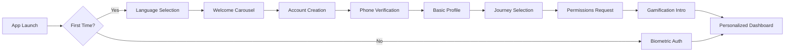
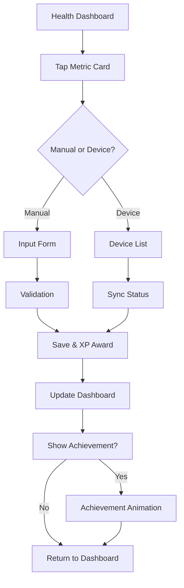
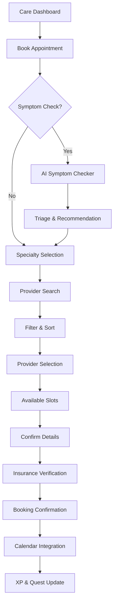
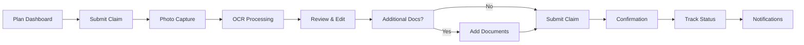

# AUSTA SuperApp - UI/UX Requirements and Design Flows

## 1. Design Principles

### 1.1 Core Design Philosophy
- **Journey-Centric**: Each journey has distinct visual identity while maintaining cohesion
- **Progressive Disclosure**: Complex features revealed gradually based on user needs
- **Accessibility-First**: WCAG 2.1 AA compliance from the ground up
- **Emotional Design**: Celebrating achievements and progress to drive engagement
- **Trust Through Transparency**: Clear data usage and security indicators

### 1.2 Journey Visual Identity

#### Health Journey (Minha Saúde)
- **Primary Color**: #0ACF83 (Vibrant Green)
- **Secondary Colors**: #E8F5E9 (Light Green), #2E7D32 (Dark Green)
- **Imagery**: Nature, vitality, growth metaphors
- **Icons**: Rounded, organic shapes
- **Micro-animations**: Smooth, flowing transitions

#### Care Journey (Cuidar-me Agora)
- **Primary Color**: #FF8C42 (Warm Orange)
- **Secondary Colors**: #FFF3E0 (Light Orange), #E65100 (Dark Orange)
- **Imagery**: Human connection, care, warmth
- **Icons**: Friendly, approachable designs
- **Micro-animations**: Welcoming, reassuring movements

#### Plan Journey (Meu Plano & Benefícios)
- **Primary Color**: #3A86FF (Trustworthy Blue)
- **Secondary Colors**: #E3F2FD (Light Blue), #1565C0 (Dark Blue)
- **Imagery**: Security, stability, organization
- **Icons**: Precise, professional shapes
- **Micro-animations**: Confident, efficient transitions

## 2. Information Architecture

### 2.1 Navigation Structure
```
├── Onboarding Flow
│   ├── Welcome & Language Selection
│   ├── Account Creation / Login
│   ├── Journey Selection
│   ├── Permissions & Consents
│   └── Initial Gamification Tutorial
│
├── Main Navigation (Tab Bar)
│   ├── Home (Dynamic Dashboard)
│   ├── Health (Green Journey)
│   ├── Care (Orange Journey)
│   ├── Plan (Blue Journey)
│   └── Profile & Rewards
│
├── Health Journey
│   ├── Dashboard
│   │   ├── Vital Signs Cards
│   │   ├── Activity Rings
│   │   └── Quick Actions
│   ├── Metrics
│   │   ├── Charts & Trends
│   │   ├── Comparisons
│   │   └── Export Options
│   ├── Goals
│   │   ├── Active Goals
│   │   ├── Suggested Goals
│   │   └── Achievements
│   └── Devices
│       ├── Connected Devices
│       ├── Add New Device
│       └── Sync Settings
│
├── Care Journey
│   ├── Symptom Checker
│   │   ├── AI Chat Interface
│   │   ├── Body Map
│   │   └── Triage Results
│   ├── Appointments
│   │   ├── Upcoming
│   │   ├── Book New
│   │   └── History
│   ├── Telemedicine
│   │   ├── Video Interface
│   │   ├── Chat
│   │   └── Document Sharing
│   └── Medications
│       ├── Current Medications
│       ├── Reminders
│       └── Refill Requests
│
├── Plan Journey
│   ├── Coverage Dashboard
│   │   ├── Benefits Summary
│   │   ├── Utilization Gauge
│   │   └── ID Cards
│   ├── Claims
│   │   ├── Submit New
│   │   ├── Track Status
│   │   └── History
│   ├── Cost Estimator
│   │   ├── Procedure Search
│   │   ├── Provider Comparison
│   │   └── Payment Options
│   └── Documents
│       ├── EOBs
│       ├── Tax Documents
│       └── Policy Details
│
└── Gamification Hub
    ├── Profile & Level
    ├── Achievements Gallery
    ├── Active Quests
    ├── Leaderboards
    └── Rewards Store
```

## 3. User Flows

### 3.1 Onboarding Flow


**Key Interactions**:
- Skip option available after first carousel slide
- Social login options (Google, Apple, Facebook)
- Progressive permission requests based on journey selection
- Interactive gamification tutorial with first XP reward

### 3.2 Health Metrics Recording Flow


**Key Interactions**:
- Haptic feedback on successful recording
- Real-time validation with helpful error messages
- Celebration animation for goal progress
- Smart suggestions based on historical data

### 3.3 Appointment Booking Flow


**Key Interactions**:
- Real-time availability updates
- One-tap rebooking for follow-ups
- Smart filtering based on past preferences
- Automatic insurance verification

### 3.4 Claim Submission Flow


**Key Interactions**:
- Camera UI with guides for document capture
- Real-time OCR with field highlighting
- Bulk document upload support
- Push notifications for status updates

## 4. Component Design Specifications

### 4.1 Dashboard Cards
```
┌─────────────────────────────┐
│ ♡ Heart Rate          ···   │ <- Journey color accent
├─────────────────────────────┤
│    72 BPM                   │ <- Large, prominent value
│    ▃▅▇▅▃▁ Last 7 days      │ <- Sparkline chart
├─────────────────────────────┤
│ ↗ Normal range │ + Add      │ <- Status & CTA
└─────────────────────────────┘
```

**Specifications**:
- Card elevation: 4dp with subtle shadow
- Corner radius: 16px
- Padding: 16px all sides
- Typography: Value in 32sp bold, labels in 14sp regular
- Tap target: Entire card (minimum 48x48dp)

### 4.2 Achievement Notifications
```
┌─────────────────────────────────┐
│ 🏆 Achievement Unlocked!        │
│                                 │
│    [Medal Animation]            │
│                                 │
│ "7-Day Streak Champion"         │
│ +250 XP                         │
│                                 │
│ [Share] [View Achievements]     │
└─────────────────────────────────┘
```

**Specifications**:
- Full-screen takeover with blur background
- Lottie animation for medal (2-3 seconds)
- Haptic feedback: Success pattern
- Auto-dismiss after 5 seconds
- Swipe down to dismiss early

### 4.3 Journey Tab Bar
```
┌───┬───┬───┬───┬───┐
│ 🏠│ 💚│ 🧡│ 💙│ 👤│  <- Filled when active
├───┼───┼───┼───┼───┤
│Hom│Hea│Car│Pla│Pro│  <- Labels (optional)
└───┴───┴───┴───┴───┘
```

**Specifications**:
- Height: 56dp (iOS), 48dp (Android)
- Icon size: 24x24dp
- Active state: Journey color fill
- Inactive state: Gray outline
- Badge support for notifications

### 4.4 Gamification Progress Bar
```
Level 12 ━━━━━━━━━━▰▱▱▱▱ Level 13
1,250 XP                450 XP to go
```

**Specifications**:
- Height: 8dp with rounded ends
- Gradient fill using journey colors
- Animated progress on XP gain
- Milestone markers at 25%, 50%, 75%
- Tap to view detailed progress

## 5. Interaction Design

### 5.1 Gesture Support
- **Swipe Down**: Refresh content (with spring animation)
- **Swipe Left/Right**: Navigate between journey tabs
- **Long Press**: Quick actions menu
- **Pinch**: Zoom on charts and body maps
- **3D Touch/Force Touch**: Preview appointments, claims

### 5.2 Animation Guidelines
| Context | Duration | Easing | Purpose |
|---------|----------|---------|----------|
| Screen transitions | 300ms | Ease-in-out | Smooth navigation |
| Card expand/collapse | 250ms | Spring | Natural feel |
| Loading states | Infinite | Linear | Progress indication |
| Success feedback | 400ms | Overshoot | Celebration |
| Error feedback | 200ms | Ease-out | Quick attention |

### 5.3 Loading States
- **Skeleton Screens**: For initial content load
- **Shimmer Effect**: For card placeholders
- **Progress Indicators**: For determinate operations
- **Micro-copy**: Contextual loading messages

### 5.4 Error Handling
```
┌─────────────────────────────┐
│    😔 Oops!                 │
│                             │
│ We couldn't load your data  │
│ right now.                  │
│                             │
│ [Try Again]  [Get Help]     │
└─────────────────────────────┘
```

**Principles**:
- Human-friendly error messages
- Clear recovery actions
- Preserve user input on errors
- Offline detection with queuing

## 6. Responsive Design

### 6.1 Breakpoints
- **Mobile**: 320px - 767px
- **Tablet**: 768px - 1023px
- **Desktop**: 1024px+

### 6.2 Layout Adaptations
#### Mobile (Default)
- Single column layout
- Bottom tab navigation
- Full-screen modals
- Vertical scrolling

#### Tablet
- Two-column layout where appropriate
- Side navigation rail
- Floating action buttons
- Modal dialogs (not full-screen)

#### Desktop (Web)
- Three-column layout for dashboards
- Persistent side navigation
- Keyboard shortcuts support
- Hover states for all interactive elements

## 7. Accessibility Requirements

### 7.1 Visual Accessibility
- **Color Contrast**: Minimum 4.5:1 for normal text, 3:1 for large text
- **Color Independence**: Never rely solely on color to convey information
- **Focus Indicators**: Visible focus states for all interactive elements
- **Text Scaling**: Support up to 200% zoom without horizontal scroll

### 7.2 Motor Accessibility
- **Touch Targets**: Minimum 44x44pt (iOS) / 48x48dp (Android)
- **Spacing**: 8dp minimum between interactive elements
- **Gesture Alternatives**: All gestures have tap alternatives
- **Time Limits**: User-adjustable for timed actions

### 7.3 Cognitive Accessibility
- **Clear Labels**: Descriptive, action-oriented button text
- **Consistent Navigation**: Same structure across all journeys
- **Error Prevention**: Confirmation for destructive actions
- **Help Available**: Contextual help on every screen

### 7.4 Screen Reader Support
- **Semantic HTML**: Proper heading hierarchy
- **ARIA Labels**: For icons and complex interactions
- **Live Regions**: For dynamic content updates
- **Skip Links**: For repetitive navigation

## 8. Performance Guidelines

### 8.1 Initial Load
- **Target**: First Contentful Paint < 1.2s
- **Strategy**: Code splitting by journey
- **Priority**: Critical CSS inline, async load rest

### 8.2 Interaction Response
- **Tap Feedback**: < 100ms
- **Screen Transition**: < 300ms
- **Data Fetch**: Show skeleton within 200ms

### 8.3 Asset Optimization
- **Images**: WebP with JPEG fallback
- **Icons**: SVG sprites for web, vector for native
- **Animations**: Lottie files < 50KB
- **Fonts**: Variable fonts with subsetting

## 9. Dark Mode Support

### 9.1 Color Adaptations
| Element | Light Mode | Dark Mode |
|---------|-----------|-----------|
| Background | #FFFFFF | #121212 |
| Surface | #F5F5F5 | #1E1E1E |
| Text Primary | #000000 | #FFFFFF |
| Text Secondary | #666666 | #B3B3B3 |

### 9.2 Journey Colors in Dark Mode
- Reduce saturation by 20%
- Increase lightness for better contrast
- Maintain brand recognition

### 9.3 Elevation in Dark Mode
- Use lighter surfaces for higher elevation
- Subtle borders instead of shadows
- Preserve depth hierarchy

## 10. Localization Considerations

### 10.1 Text Expansion
- Design for 30% text expansion (English to Portuguese)
- Use flexible layouts, avoid fixed widths
- Test with longest possible strings

### 10.2 Cultural Adaptations
- **Date Format**: DD/MM/YYYY for Brazil
- **Currency**: R$ with proper formatting
- **Phone Numbers**: +55 format with masks
- **Names**: Support for compound surnames

### 10.3 RTL Support (Future)
- Mirrored layouts except for:
  - Clocks and time representations
  - Media playback controls
  - Charts and graphs

## 11. Platform-Specific Guidelines

### 11.1 iOS Adaptations
- **Navigation**: iOS-style back gestures
- **Haptics**: Taptic Engine feedback
- **Safe Areas**: Respect notch and home indicator
- **Typography**: San Francisco font

### 11.2 Android Adaptations
- **Navigation**: Material Design patterns
- **Back Button**: Hardware/gesture support
- **Material You**: Dynamic color theming
- **Typography**: Roboto font

### 11.3 Web Adaptations
- **Navigation**: Breadcrumbs for deep navigation
- **Keyboard**: Full keyboard navigation
- **Browser**: Back/forward button support
- **PWA**: Offline support with service workers

## 12. Design System Components

### 12.1 Component Library Structure
```
design-system/
├── tokens/
│   ├── colors.ts
│   ├── typography.ts
│   ├── spacing.ts
│   └── animations.ts
├── primitives/
│   ├── Button/
│   ├── Card/
│   ├── Input/
│   └── Modal/
├── patterns/
│   ├── Dashboard/
│   ├── Forms/
│   ├── Navigation/
│   └── Gamification/
└── journeys/
    ├── health/
    ├── care/
    └── plan/
```

### 12.2 Component Documentation
- **Storybook**: Interactive component showcase
- **Design Tokens**: Figma variables sync
- **Usage Guidelines**: Do's and don'ts
- **Accessibility Notes**: Per component

### 12.3 Version Control
- **Semantic Versioning**: Major.Minor.Patch
- **Breaking Changes**: Migration guides
- **Deprecation**: 2-version warning period
- **Changelog**: Detailed per release

## 13. Metrics and Analytics

### 13.1 UX Metrics to Track
- **Task Success Rate**: Appointment booking, claim submission
- **Time on Task**: Key user flows
- **Error Rate**: Form submissions, API calls
- **Engagement**: Session length, journey switching

### 13.2 A/B Testing Framework
- **Test Duration**: Minimum 2 weeks
- **Sample Size**: Statistical significance
- **Metrics**: Primary and secondary KPIs
- **Documentation**: Test rationale and results

### 13.3 User Feedback Integration
- **In-App Surveys**: Post-task micro-surveys
- **NPS Tracking**: Quarterly measurement
- **Feature Requests**: Voting mechanism
- **Bug Reports**: Screenshot capability