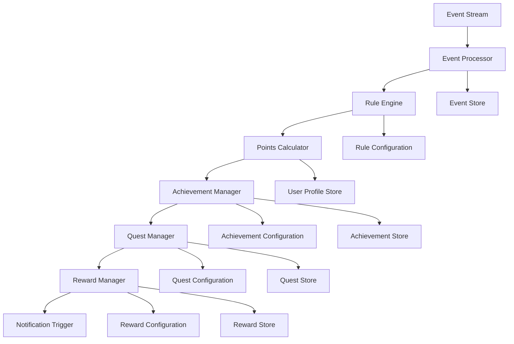

# AUSTA SuperApp Gamification Engine

## Overview

The Gamification Engine is a core component of the AUSTA SuperApp that drives user engagement across all journeys through points, achievements, quests, and rewards. It processes events from user actions, applies configurable rules, and creates a motivational feedback loop that encourages positive health behaviors.

### Key Features

- **Event-driven architecture** with high-throughput event processing
- **Rule-based achievement system** with configurable conditions and rewards
- **Real-time progress tracking** across all user journeys
- **Journey-specific achievements** for Health, Care, and Plan journeys
- **Leveling system** with XP (experience points) accumulation
- **Reward distribution** for achievement unlocks and level progression
- **Leaderboards** for social comparison and motivation
- **Analytics integration** for measuring engagement impact on health outcomes

## Technical Architecture

The Gamification Engine follows an event-driven microservice architecture:



The engine processes over 1,000 events per second with sub-50ms latency, ensuring real-time feedback to users across all journeys.

## Getting Started

### Prerequisites

- Node.js 18.x or later
- Docker and Docker Compose
- PostgreSQL 14 or later
- Redis 7.0 or later
- Kafka for event streaming

### Installation

1. Clone the repository:
   ```bash
   git clone https://github.com/austa/superapp.git
   cd superapp/src/backend/gamification-engine
   ```

2. Install dependencies:
   ```bash
   npm install
   ```

3. Set up environment variables (see Configuration section below)

4. Set up the database:
   ```bash
   npm run db:migrate
   npm run db:seed
   ```

### Running with Docker

The simplest way to run the service is using Docker Compose:

```bash
docker-compose up -d
```

This will start the Gamification Engine along with its dependencies (Redis, PostgreSQL, and Kafka).

### Running Locally

For development:

```bash
npm run dev
```

For production:

```bash
npm run build
npm start
```

### Running Tests

```bash
# Unit tests
npm run test

# Integration tests
npm run test:integration

# End-to-end tests
npm run test:e2e

# All tests with coverage
npm run test:coverage
```

## API Documentation

The Gamification Engine exposes both REST and GraphQL APIs:

### GraphQL API

The GraphQL API is available at `/graphql` and provides access to all engine functionality. Detailed documentation is available via the GraphQL Playground, which is accessible at the same endpoint when running in development mode.

### REST API

The REST API provides endpoints for:

- Processing events: `POST /api/events`
- Managing achievements: `GET /api/achievements`
- User profiles: `GET /api/profiles/:userId`
- Leaderboards: `GET /api/leaderboards/:boardId`

For detailed API documentation, see the [API Reference](./docs/api-reference.md) or run the service and visit `/api-docs` for Swagger documentation.

## Configuration

### Environment Variables

| Variable | Description | Default | Required |
|----------|-------------|---------|----------|
| `NODE_ENV` | Environment (development, test, production) | `development` | Yes |
| `PORT` | HTTP port | `3002` | No |
| `DATABASE_URL` | PostgreSQL connection string | - | Yes |
| `REDIS_URL` | Redis connection string | - | Yes |
| `KAFKA_BROKERS` | Comma-separated list of Kafka brokers | - | Yes |
| `KAFKA_TOPIC` | Kafka topic for gamification events | `gamification.events` | No |
| `JWT_SECRET` | Secret for JWT verification | - | Yes |
| `LOG_LEVEL` | Logging level | `info` | No |
| `RULES_REFRESH_INTERVAL` | Interval (ms) for refreshing rules from DB | `60000` | No |
| `ACHIEVEMENT_BATCH_SIZE` | Batch size for achievement processing | `100` | No |
| `REDIS_CACHE_TTL` | TTL for cached data in seconds | `300` | No |

### Rules Configuration

The Gamification Engine uses a flexible rule configuration system that can be managed through the database or configuration files:

```json
{
  "rules": [
    {
      "id": "daily-steps-goal",
      "event": "STEPS_RECORDED",
      "condition": "event.data.steps >= userState.goals.dailySteps",
      "actions": [
        {
          "type": "AWARD_XP",
          "value": 50
        },
        {
          "type": "PROGRESS_QUEST",
          "questId": "active-lifestyle",
          "value": 1
        }
      ]
    }
  ]
}
```

For detailed configuration options, see the [Rules Documentation](./docs/rules-configuration.md).

## Event Schema

Events sent to the Gamification Engine should follow this schema:

```typescript
interface GamificationEvent {
  type: string;            // Event type (e.g., "STEPS_RECORDED", "APPOINTMENT_BOOKED")
  userId: string;          // User ID
  timestamp: string;       // ISO timestamp
  journey: "health" | "care" | "plan" | "common";  // Journey context
  data: {                  // Event-specific data
    [key: string]: any;
  };
  metadata?: {             // Optional metadata
    source: string;        // Source system
    version: string;       // Source system version
    [key: string]: any;
  };
}
```

## Journeys and Achievement Types

The Gamification Engine supports achievements across all three journeys:

| Journey | Example Achievements | Typical Events |
|---------|---------------------|----------------|
| Health | Activity Streaks, Health Goals, Metrics Tracking | Steps Recorded, Goal Achieved, Device Connected |
| Care | Appointment Attendance, Medication Adherence, Treatment Completion | Appointment Booked, Medication Taken, Treatment Completed |
| Plan | Claim Submissions, Coverage Utilization, Benefit Discovery | Claim Submitted, Coverage Checked, Benefit Used |

## Performance Considerations

The Gamification Engine is designed for high throughput and low latency:

- Event processing rate: Up to 5,000 events/second
- Processing latency: < 30ms per event
- Rule evaluation: Optimized for fast condition checking
- Redis caching: Used for user state and frequent lookups
- Database interactions: Batched for efficiency

## Contributing

We welcome contributions to the Gamification Engine! Please follow these guidelines:

1. Fork the repository
2. Create a feature branch: `git checkout -b feature/your-feature-name`
3. Commit your changes: `git commit -am 'Add some feature'`
4. Push to the branch: `git push origin feature/your-feature-name`
5. Submit a pull request

### Coding Standards

- Follow the TypeScript style guide
- Write unit tests for all new functionality
- Maintain or improve code coverage
- Document public APIs with JSDoc
- Use semantic commit messages

### Development Process

1. Check the issues for existing tasks or create a new one
2. Discuss approach in the issue before starting development
3. Write tests before implementation (TDD preferred)
4. Ensure all tests pass before submitting PR
5. Request code review from at least one maintainer

## License

This project is licensed under the [MIT License](LICENSE).

## Contact

For questions or support, please contact the AUSTA development team at dev@austa.com.br.